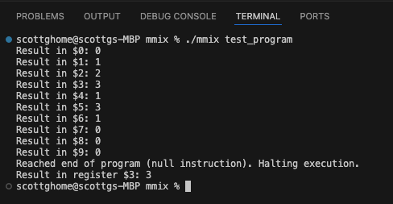

# mmix

mmix in C   

   

<pre>
To generate a simple test program:         
% echo "48 01 00 01 48 02 00 02 20 03 01 02" > test_program.hex  

% xxd -r -p test_program.hex test_program  

% hexdump test_program
0000000 0148 0100 0248 0200 0320 0201          
000000c

test_program has SETH and ADD MMIX instructions:
SETH $1,#0001   // Set $1 to 1
SETH $2,#0002   // Set $2 to 2
ADD $3,$1,$2    // Add $1 and $2, store result in $3

in hexidecimal, these instructions are represented as:
48 01 00 01   // SETH $1,#0001
48 02 00 02   // SETH $2,#0002
20 03 01 02   // ADD $3,$1,$2

To run:  
# make && ./mmix test_program  
</pre>

  

